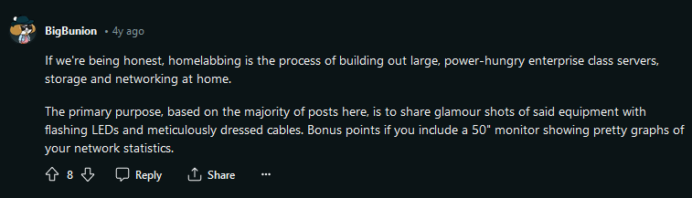

# Home Labbing

Yep! as many other things I'm interested on, I'm really into home labbing. Now maybe you're stuck in one of these two questions:

- What's home labbing? Maybe this image illustrate it.

- Why do I like home labbing?
    I advocate for freedom in every possible way, so in terms of technology we're constantly selling (or giving it for free) our freedom to large companies like microsoft, meta or google. Fuck them, honestly and sorry :).
    With that in mind, you can conclude by yourself than, somehow home labbing makes me feel more freedom, so, yes, my bigger goal with my home labbing project is to selfhost solutions for my everyday taks and problems like git/mercurial repositories management, file storage/sharing, audio/video streaming and more. So, that's it!

The home labbing series will be stored in the [blog](../blog/index), labeled as Home Labbing Log.

Keep on track and enjoy as much as me.